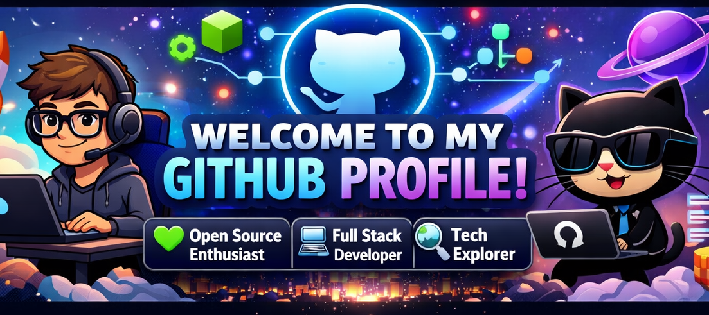

  

# Hi 👋, I'm ARYAN

### A passionate developer from gurugram

## 🚀 About Me

I'm a student with a keen interest in frontend web development. I love creating intuitive and responsive digital experiences. Currently exploring new technologies while working on projects like Campus to Corporate and Librohub. Always open to collaborations and learning opportunities!

# 💻 Tech Stack:
                    

# 📊 GitHub Stats:
 
 

---

<!-- Proudly created with GPRM ( https://gprm.itsvg.in ) -->
## 📚 Learning & Knowledge

- 🌱 I'm currently learning more about project structures to have knowledge in building projects and also working on dsa.

## 🚀 Projects

| Project | Description | Links |
|---|---|---|
| LIBROHUB |  An online library management system for browsing, searching, and managing book collections. Includes user authentication, recommendations, and an admin panel. | [GitHub](https://github.com/aryanassit/library-system.git) |

### LIBROHUB

  

## 📞 Contact & Links

<h3><i>How to reach me🤝 : aryanassit@gmail.com </i></h3>

## ⚡ Fun Fact

*I CAN MAKE U LAUGH*

## 🌐 Connect with Me

&nbsp;&nbsp;&nbsp;&nbsp;&nbsp;&nbsp;

### 🎯 "Code is like humor. When you have to explain it, it's bad." – Cory House

**Thank you for visiting my profile! 😊**

